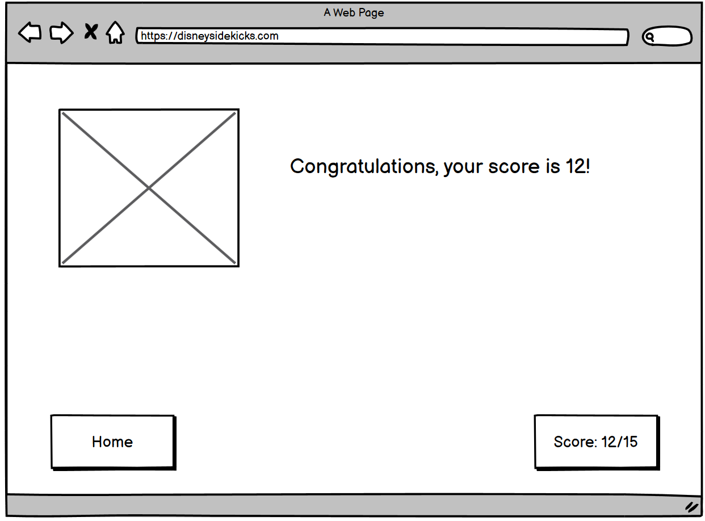
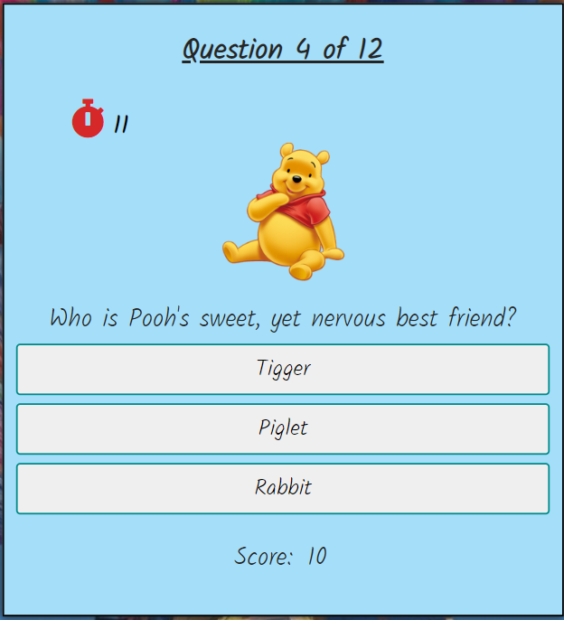
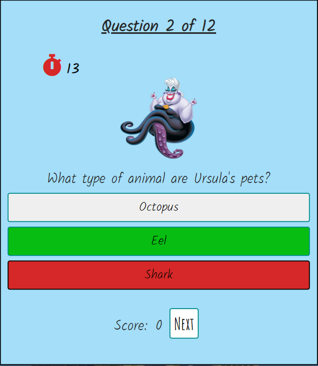
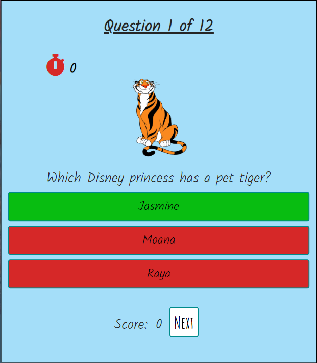

# **_Disney Sidekicks_**

Disney Sidekicks is an interactive quiz website where users can test their Disney knowledge to the max. This is not just the usual quiz about the Disney main characters, but focuses solely on pets and sidekicks who have a supporting role and often get forgotten.  In many cases, these characters have an important role to play in the story and even have some of the best scripts and comic moments of all.  For example In 1992's Aladdin, who could have imagined such strength of character from of a carpet, which couldn't even talk! This is the magic of Disney. 

Welcome to <a href="https://quiltingcode.github.io/disneysidekicks/" target="_blank" rel="noopener">Disney Sidekicks</a>

# Contents

* [**User Experience UX**](<#user-experience-ux>)
    * [Wireframes](<#wireframes>)
    * [Site Structure](<#site-structure>)
    * [Design Choices](<#design-choices>)
      * [Typography](<#typography>)
      * [Colour Scheme](<#colour-scheme>)
* [**Current Features**](<#current-features>)
    * [Home Page](<#home-page>)
    * [Rules Page](<#rules-page>)
    * [Quiz Page](<#quiz-page>)
    * [End Page](<#end-page>)
* [**Future Features**](<#future-features>)
* [**Technologies Used**](<#technologies-used>)
* [**Testing**](<#testing>)
* [**Deployment**](<#deployment>)
* [**Credits**](<#credits>)
    * [**Content**](<#content>)
    * [**Media**](<#media>)
*  [**Acknowledgements**](<#acknowledgements>)

# User Experience (UX)

## Wireframes

The wireframes for the Disney Sidekicks project were produced in Balsamiq.  There are frames for a desktop device and for a mobile device.  

## Desktop Device Wireframes 

## Mobile Device Wireframes

I designed this quiz with a mobile design in mind initially, as I wanted to make sure the quiz was visible on a smaller screen.  However, I also created wireframes for a larger version of the quiz for desktop devices. The quiz has been created within one single html page, but through the use of Javascript, there are three main views of this page depending on which button is selected. Therefore, I have created wireframes for these three main views; the initial home page, the look of the quiz itself, and the final end of quiz page. 

[Back to top](<#contents>)

## Site Structure

The Disney Sidekicks quiz has been created within a single HTML page. The homepage is the initial default loading page with two buttons available to the user. 'Start' or 'Rules'. The 'Rules' button shows the rules on screen, and the 'Start' button starts the quiz. You can move through each page of the quiz via a 'Next' button and then once the quiz has finished, the user is taken to a Summary page where they are told their score, and given two more button options; 'Home', which takes them back to the homepage, or 'Play Again' which takes them back to the start of a new quiz.

[Back to top](<#contents>)

## Design Choices

 * ### Typography

The fonts I chose were ‘Amatic SC’ for the h1 main heading and the buttons, and ‘Kalam’ for the body text and questions.  If these fonts are not available, they revert to cursive and sans-serif.  I chose the ‘Amatic SC’ font primarily as I wanted something fun and playful to reflect the theme of the quiz. This also automatically captilises all the letters which is good for the buttons and makes the main header stand out. The 'Kalam' body font nicely compliments the header font in it's fun 'handwriting' style whilst remaining clearly legible for users to read the quiz questions and answers.

 * ### Colour Scheme

Initially, I wanted to use same colour palette as those which are used for the original Disney Magic Kingdom logo; found [here](https://www.schemecolor.com/disney-color.php) These are:

However, having styled these into the backgruond, the colours appeared to me quite dated. So I continued my research further into more modern Disney colour palettes. I soon came across a Disney colour palette [website](https://www.sitepoint.com/15-color-schemes-from-disney-heroes-and-villains/) which suggested various colour palettes depending on the style of the Disney film, whether it was based on princesses, or animals, or villains etc. 

From this 'princess' colour scheme, I chose to style the background and game area container with a combination of the #a4def9 and the #c59fc9 tones, which looked nice, and to me represent a combination of a classic 'Cinderella' tone with a more modern background 'Rapunzel' tone. 

When I took a step back and looked at these through the [Am I Responsive](https://ui.dev/amiresponsive) Mockup website, I still thought it looked a bit plain. 

In the end, I kept the 'Cinderella' blue and changed the background for a Disney image from the 2009 film 'Up' that worked on various screen sizes. I had to change the colour of the header to white so that you could still see it clearly through the coloured baloons. 

[Back to top](<#contents>)

# Current Features

  
## Home Page

At the top of the website is the main title and an introduction to the quiz. The game logo is displayed here, and I've also used the same image for the site's Favicon in the browser. This image shows the most famous of all the Disney characters, Mickey Mouse, and his  trusty sidekick, Pluto.  Underneath the quiz introduction, there are two buttons to choose from. A 'Rules' button and a 'Start Quiz' button. If the user clicks the 'Rules' button, the quiz introduction text is replaced by a set of rules, and only the 'Start Quiz' button remains.  If the user clicks the 'Start Button', the quiz introduction and the two buttons disappear, and are replaced with the Quiz Page.

[Back to top](<#contents>)

## Rules Page

If the user is unsure of how to play a quiz game, at the bottom of the Home Page they can select the 'Rules' button which will show them a set of simple instructions. Under the rules there is a button option to 'Start' the game.  

[Back to top](<#contents>)

## Quiz Page

Once the user has selected the 'Start Quiz' button from either the Home page or Rules Page, the introduction, rules, logo and buttons disappear. The quiz area then becomes visible to the user and the game can begin. 

At the top of the quiz area, the user is told which question they are on out of a total of 12 questions. Each time the quiz is played, a new random selection of questions will be drawn from the questions array.

Next, an image is displayed which changes according to the particular question drawn. Under the image, the user can read the quiz question and three possible answers displayed in clickable buttons. Finally the user can see their score throughout the quiz. 

Once an answer has been selected, depending on which button is pressed, various things may or may not occur. If the user selects the correct answer, the selected button will turn green to tell the user that it's correct, the score will go up by 10 points, and a 'Next' button will appear to move on to the next question. If however the user selects an incorrect answer, the selected button will turn red, the correct answer will turn green to show which button the user should have chosen, the score does not change, and the 'Next' button will appear to move on to the next question. 

Having finished building the quiz game, I decided that I could create an additional timer element to make the game more fun.  The user is given 15 seconds to answer each question, and the countdown begins as soon as the question is displayed. If an answer button is clicked within the 15 second limit, the timer stops and the user is given feedback on their response as normal. If the timer runs out and no answer has been selected, the correct answer and two incorrect answers are highlighted, no points are awarded, and the next button is displayed to continue on to the next question.

A countdown stopwatch icon is displayed in 'Aladdin' red to stand out to the user and show them that a countdown has begun, and I set the font-weight of the numbers to bold to draw the eye.

[Back to top](<#contents>)

## End Page

Once 12 questions have been answered, when the user clicks the 'Next' button the quiz is finished, the questions disappear and they are replaced by a summary of how well the user did. If they score more than 80 points, they will see an image of a very happy Sidekick and a message congratulating them on their score.

if the player gets 80 points or lower, they will see an image of Aladdin's magic carpet looking very sad and receive a message of comiseration.

In both cases, the user has two button options for how to continue from this screen. They can select 'Play Again' which will reset the quiz, select a new set of question, set their score back to zero and present them with a new question. Or they can select 'Home' which will take them back to the Home Page.

[Back to top](<#contents>)

## Future Features 

In the future, I would like to add more features to the Disney Sidekicks Quiz. These could include:

* A time limit for each question to add an element of speed and excitement
* Add more questions to the questions array. 

[Back to top](<#contents>)

# Technologies Used

I used the following technologies to create this website:

* HTML5 – Content and structure
* CSS - Styling
* Javascript - Game functions
* Balsamiq – Wireframe designs
* Gitpod – Website deployment
* Github – Website hosting

[Back to top](<#contents>)

# Testing

Please click [**_here_**](TESTING.md) to read more information about testing Love Andalucia

[Back to top](<#contents>)

# Deployment

### **To deploy the project**
The site was deployed to GitHub pages. The steps to deploy a site are as follows:
  1. In the GitHub repository, navigate to the **Settings** tab.
  2. Once in Settings, navigate to the **Pages** tab down the side menu.
  3. Under **Source**, select the branch to **master**, then click **save**.
  4. Once the master branch has been selected, the page will be automatically refreshed with a detailed ribbon display to indicate a successful deployment.

  The live link to the Github repository can be found here - https://quiltingcode.github.io/disneysidekicks/

### **To fork the repository using GitHub**
A copy of the GitHub Repository can be made by forking the GitHub account. This copy can be viewed and changes can be made to the copy without affecting the original repository. Take the following steps to fork the repository:
1. Log in to **GitHub** and locate the [repository](https://github.com/quiltingcode/disneysidekicks).
2. On the right hand side of the page inline with the repository name is a button called **'Fork'**, click on the button to create a copy of the original repository in your GitHub Account.

### **To create a local clone of this project**
The method from cloning a project from GitHub is below:

1. Under the repository’s name, click on the **code** tab.
2. In the **Clone with HTTPS** section, click on the clipboard icon to copy the given URL.

3. In your IDE of choice, open **Git Bash**.
4. Change the current working directory to the location where you want the cloned directory to be made.
5. Type **git clone**, and then paste the URL copied from GitHub.
6. Press **enter** and the local clone will be created.

[Back to top](<#contents>)

# Credits
### Content

* The colour scheme was researched from the following websites:
    * https://www.sitepoint.com/15-color-schemes-from-disney-heroes-and-villains/
    * https://www.schemecolor.com/disney-color.php
* Tutorials on how to create a quiz game with javascript were found on Youtube. One by [Web Dev Simplified](https://www.youtube.com/watch?v=riDzcEQbX6k) and another by [Brian Design](https://www.youtube.com/watch?v=f4fB9Xg2JEY)
* I also watched another tutorial by [Web Dev Simplified](https://www.youtube.com/watch?v=rIO5326FgPE) explaining the CSS Box Model, to help create the various game containers.
* Information for how to Hide and Show Divs was taken from [W3Schools](W3schools.com/howto/howto_js_toggle_hide_show.asp)
* [Balsamiq](https://balsamiq.com/wireframes/) was used to create the wireframes.
* The Favicon in the browser was created in https://favicon.io/
* The fonts were taken from [Google Fonts](https://fonts.google.com/)
* I used two different websites for help learning how to shuffle the questions array each time a game was started. I used [Geeks for Geeks](https://www.geeksforgeeks.org/shuffle-or-randomize-a-list-in-java/) and [Sebhastian.com](https://sebhastian.com/shuffle-array-javascript/#:~:text=A%20JavaScript%20array%20elements%20can,using%20the%20sort()%20method.&text=The%20JavaScript%20Array%20sort(),value%20returned%20by%20that%20function.)
* The quiz questions were created with the aid of [Bustle.com](https://www.bustle.com/entertainment/91807-35-disney-sidekicks-ranked-from-meeko-flit-to-the-seven-dwarves)
* I used a YouTube tutorial by [The Coding Train](https://www.youtube.com/watch?v=MLtAMg9_Svw) to learn how to add a countdown timer element to the page.
 

### Media
* The images used in this website were sourced from:
  ** imgbin.com
  ** pngwing.com
* The background image was sourced from https://fondosmil.com/disney
* The question images were compressed using https://tinypng.com/ 

[Back to top](<#contents>)

# Acknowledgements
The site was completed as a Portfolio 2 Project piece for the Full Stack Software Developer (e-Commerce) Diploma at the [Code Institute](https://codeinstitute.net/). As such I would like to thank my mentor [Precious Ijege](https://www.linkedin.com/in/precious-ijege-908a00168/), the Slack community, and all at the Code Institute for their help and support. I love Disney, and it was a joy to be able to create a quiz dedicated to somethin i'm really passionate about.

Kelly Hutchison 2022.

[Back to top](<#contents>)