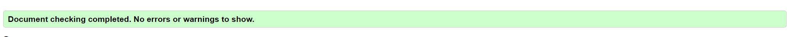
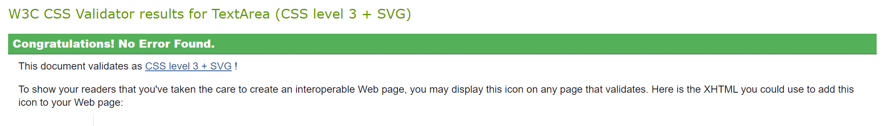
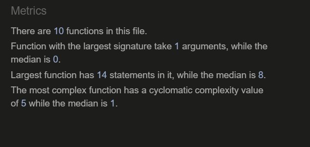
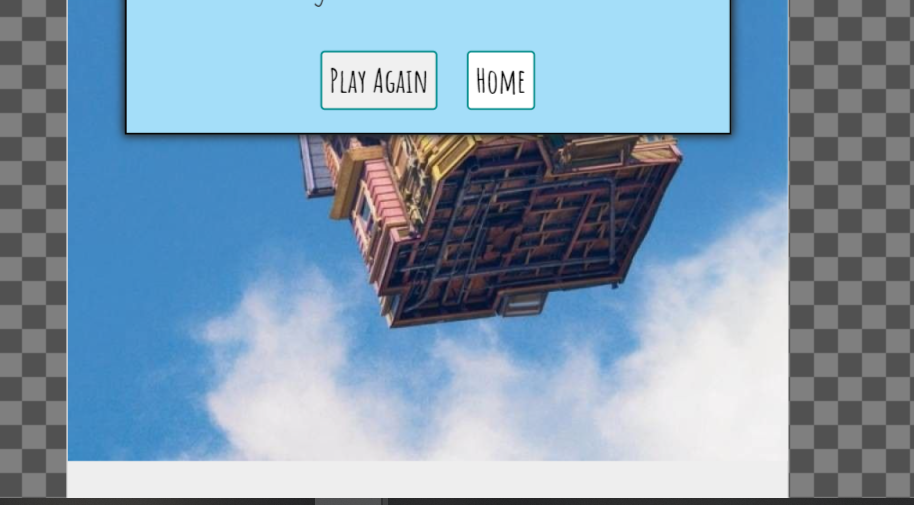
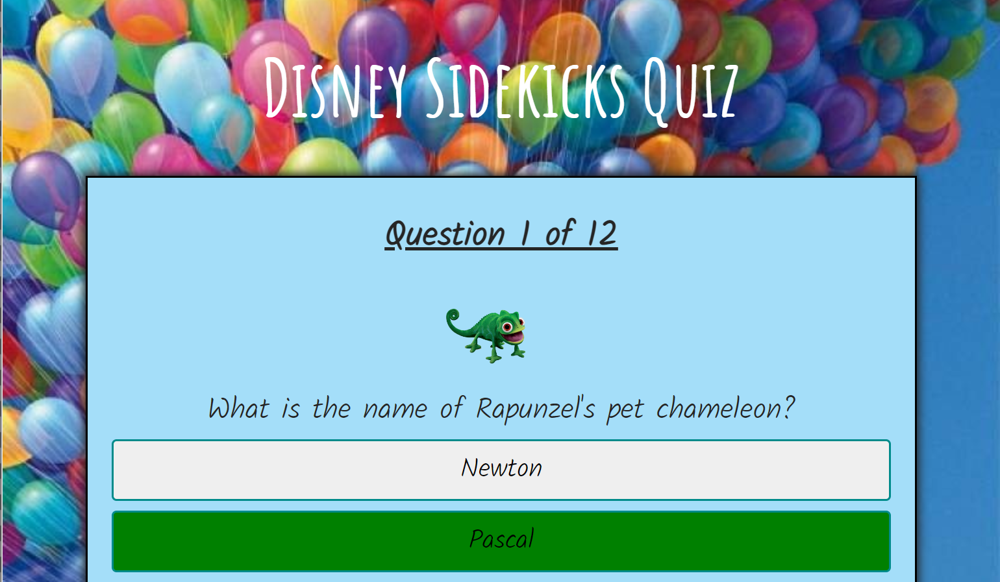
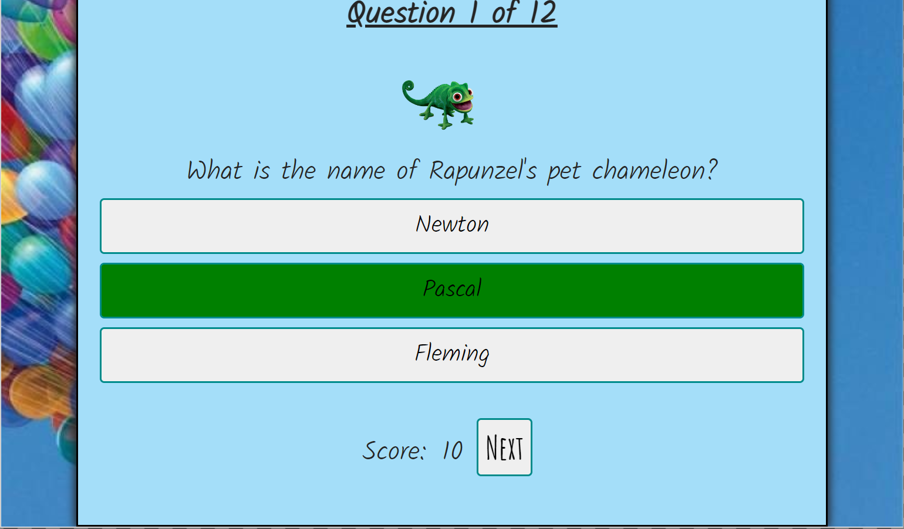
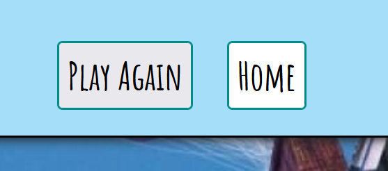
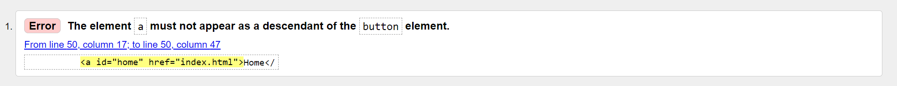
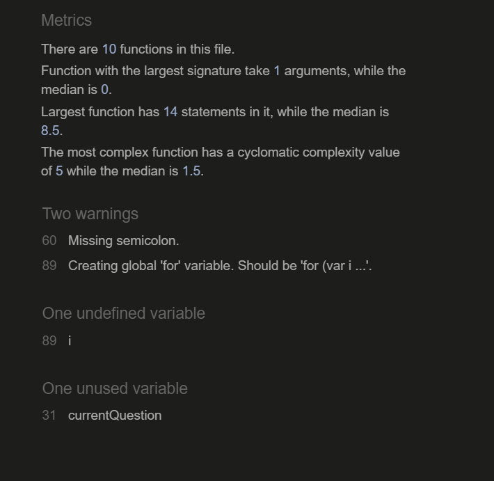
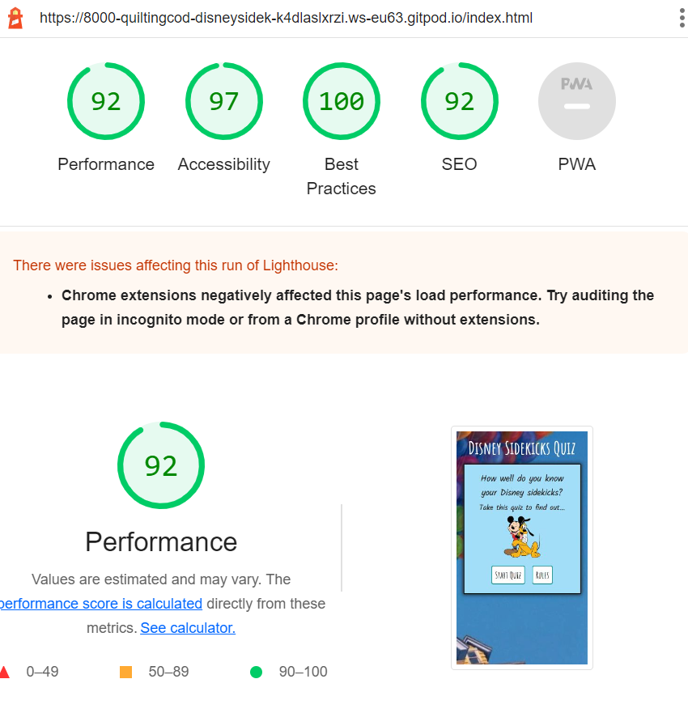

# **_Disney Sidekicks_**

# Testing

## Code Validation

The Disney Sidekicks site has been passed through the [W3C html Validator](https://validator.w3.org/), the [W3C CSS Validator](https://jigsaw.w3.org/css-validator/) and the [JS Hint Validator](https://jshint.com/).

## W3C html Validation Results

* Index.html - 1 error. Details can be found in the [Bugs](<#known-bugs>) section. The issue was easily fixed and after a retest, no more errors were returned.

## W3C CSS Validation Results

* Style.css – No errors were found.

## JS Hint Validation Results

* Script.js - 2 warnings, 1 undefined variable and 1 unused variable found.  Details can be found in the [Bugs](<#known-bugs>) section. The issues were fixed and after further testing, no more errors were returned.

## Responsiveness Test

The responsive design tests were carried out manually throughout the build using Google Chrome Dev Tools. I used a mobile first approach basing my initial design around the iPhone SE (375 x 667px) which became my first media query break point. I then selected one more break point at 768px and above for larger devices. 

During the testing process I also used the [Responsive Design Checker](https://www.responsivedesignchecker.com/) website to simulate the website on several other devices. Here are my findings:

### Mobile Devices

||
iPhone 6/7 plus

414 x 736
|
Samsung Galaxy S5/6/7

360 x 640
|
Google Pixel/Nexus 5/6

411 x 731
|
| :- | :-: | :-: | :-: |
|Render|Pass |Pass|Pass|
|Images|Pass|Pass|Pass|
|Links|Pass|Pass|Pass|

I chose not to test the iPhone models 3, 4, or 5 as these have a smaller screen (320 x 480) and were only supported officially by Apple until March 2021. 

On devices with a height of 640 pixels, such as the Samsung mobile devices, once the quiz has begun, you have to scroll down after choosing an answer to see the bottom of the question container in some cases where the question is longer. The next button sometimes is slightly hidden, but I find this scrolling acceptable in the case of certain longer questions for shorter devices. 

### Tablet Devices

||
Amazon Kindle Fire

768 x 1024
|
Samsung Galaxy Tab 10

800 x 1280
|
Apple iPad Pro

1366 x 1024

|
| :- | :-: | :-: | :-: |
|Render|Pass|Pass(2nd time)|Pass |
|Images|Pass|Pass|Pass|
|Links|Pass|Pass|Pass|

When I tested the form page on the Samsung Galaxy Tab 10, the background image was not reaching the bottom of the screen, so it was leaving a blank area across the bottom of the device. I changed the CSS styling of the background size from 'Auto' to '200rem' and I have re-tested. The image now seems to cover the full screen, on taller devices. I don't like it however that the image is moving on each click of the buttons. 

On the larger Apple iPad Pro, the rules text appears very small in comparison with the relative screen size. I have therefore decided to create a third media query break point at 1200px to make the font bigger for wider screens.

### Desktop Devices

||
24 “ Desktop

1920 x 1200
|
19” Desktop

1440 x 900
|
10” Notebook

1024 x 600
|
| :- | :-: | :-: | :-: |
|Render|Pass|Pass|Pass|
|Images|Pass|Pass|Pass|
|Links|Pass|Pass|Pass|

Playing the quiz on the 10inch Notebook, the display appears odd because the dimensions are very wide but very short; shorter in fact than most mobile devices. Therefore, when this device is in use, more scrolling is required. You have to scroll down slightly in the 'Rules' screen to reach the 'Start Quiz' button which is only half visible, and then once the quiz has begun, you have to scroll down to see all the answer options at once which means you lose sight of the header whilst playing. I find this acceptable as once the quiz has begun and you have scrolled down to the game area, you don't have to scroll anymore whilst playing the game.

## Browser Compatibility 

Disney Sidekicks was tested on the following browsers:

- Google Chrome
- Microsoft Edge
- Mozilla Firefox

I do not have any Apple devices available to carry out testing on a Safari browser. Appearance and functionality appear to be consistent throughout all browsers.

When I tested the quiz game using Mozilla Firefox, I noticed on the final End Page screen, that the two buttons were slightly different colours. This is because the styling on the buttons are all using the default background colour, but the home anchor tag has a specified background colour of 'white'. 

I have now added a background colour of 'white' to all the buttons to maintain continuity throughout the game.  

## Known Bugs

### Resolved

1. The .hide class elements have a display setting of 'none' but the #answer-area id element has a display setting of 'grid'. For this reason, due to the rules of specificity, the answer-area container would not hide itself when called by the javascript. I had to change the id of answer-area to a class, and I moved the hide styling below the grid styling. This resolved the issue, and now all items hide correctly when called by the Javascript.

2. I was getting a console.log and screen read out in the answer buttons of 'Undefined' as the javascript can't find the three answer options and place their text into the three corresponding buttons on screen. I really struggled with this element of the Javascript, pin-pointing a text value within an object within an array. I went to Tutor Support and they helped me work through finding the correct path, as well as suggesting I review the following [Stack Overflow](https://stackoverflow.com/questions/256754/how-to-pass-arguments-to-addeventlistener-listener-function ) article. In the end, I managed to find the correct syntax to locate the answer text desired.

3. The increment score function was incrementing the score each time by 3, instead of 1. I believe the cause of this was down to the score++ begin inside the loop to check the three answer boxes for the correct answer, and was therefore carrying out the increment score routine 3 times. I still couldn't really understand why this was happening, and when I used Google Dev Tools to review the console.log, it was logging 'checking answer' only once so it didn't appear to be triplicating the checkAnswer function three times, but within this function it was however logging 'correct' three times.  I asked for advice from the Slack Community on this issue, and they suggested what I suspected and agreed that I needed to change the method of looping through the answer buttons and listening for a click on the right answer, as this was causing the after effects to occur multiple times. I therefore removed the loop through the answer buttons and event listener, and instead created three separate event listeners; one for each answer button. In this way, once a correct or incorrect answer was selected, the 'correct' or 'incorrect' function was only called once, and in the event of a correct selection, the score was only incremented by one. I since decided that each correct answer now receives 10 points and this works correctly using a fixed variable of scorePoints.

4. Due to the shuffle function, sometimes the same question would appear several times within the same quiz game, and this is not good for user experience. I therefore added a 'splice' method into the nextQuestion function, so that each time a new question is called, the current question is removed from the array. The full array is shuffled when the 'Play Again' button is selected at the end and the resetGame function is called. 

5. When the game has been played twice, during the third game on question 7 there are no more questions left in the questions array, and an error occurs.  I therefore needed to add in a function once the game is reset to restore all the questions back into the array. I wasn't sure how to do this but I found an article in Stack Overflow that helped. I created a separate empty array to store the spliced questions, and then on resetGame I move the objects out of the removed array and back into the questions array.

6. I realised that during the checkAnswer function, the clicked answer button turned green if correct and red if incorrect.  However, if the user selects an incorrect answer, the game doesn't actually tell them which answer was the correct one. Therefore, I amended the function to also highlight the correct answer button in green even when a different button has been pressed. This adds to a better user experience overall. 

7. If you choose the 'Play Again' button, the score accumulated from the previous game. I added a line into the resetGame function to reset the correct answer counter back to 0 each time the game begins. 

8. The images were taking a long time to load, and this was not giving a nice user experience when the questions and answers are all available on screen and the timer counting down but the logo not yet fully loaded. I decided to compress all the quiz images using tinypng.com and this helped a lot to reduce load time. 

9. When I created the countdown timer I used the setInterval method that I learnt in a [YouTube](https://www.youtube.com/watch?v=MLtAMg9_Svw) tutorial. This website was only a single page however, and didn't include any methods to start or stop the timer. I initially put the SetInterval command inside the countdown function, but this was causing the time to increase exponentially every second as countdown was being called multiple times. But when I moved the setInterval out of the function it started the countdown as soon as the homepage was loaded and by the time the user clicked 'Start Quiz', the first question had already timed out. Tutor Support gave me the link to a helpful [W3Schools article](https://www.w3schools.com/jsref/met_element_addeventlistener.asp) which explained how to change the syntax of an event listener to call multiple functions. I used this article to change the syntax of my 'Start Game' button and 'Next' button to both call a new question but also start the countdown. Tutor Support also sent me a link to another [W3Schools article](https://www.w3schools.com/jsref/met_win_clearinterval.asp) which taught me the clearInterval function to stop the countdown. 

10. As a result of the W3C html validation test, the index.html page had 1 error. 

This error says that I have used an  tag within a button element for my link back to the home page from the end page, but according to the W3 Validator this is not allowed.  I therefore removed the button element and styled the anchor element to look the same as the other buttons, so from a user point of view there is no difference.

11. As a result of the JS Hint validation test, 2 warnings, 1 undefined variable and 1 unused variable were found.

Initially, 45 warnings were found, but when I asked the question in the Slack forum as to why I had so many "'let' is available in ES6 (use 'esversion: 6') or Mozilla JS extensions (use moz)." errors, I was informed that this was simply a case of changing the JS Hint configuration to include New JavaScript Features (ES6) which were not previously included.

Having changed the configuration I was left with 2 warnings:
 * A missing semi-colon
 * A missing let variable inside a for loop

The undefined 'i' variable that I had created was inside a loop to retrieve the 3 possible answer objects from the questions array. However, it turns out that a loop was not necessary and therefore the variable was not doing anything. I removed the loop function and left the three answers and question image as separate commands within the displayQuestion function, and after testing the game again, the questions, answers and image are all still retrieved correctly. 

This left me with a simple issue of a global variable which I created initally, but never included in my functions in the end. I deleted this variable and re-ran the full length of code through the validator with no errors returned. 

### Unresolved

1. In the console log, I can see that when the End Page is loaded, the countdown function is called, and the timer counts down and then times out. This makes no difference to the overall game functionality and the user can't see that this is happening unless they open the console. I have set the clearInterval function within the endGame function and the nextQuestion function if the user has reached question number 12, but this doesn't seem to work correctly. 

## Additional Testing

### Lighthouse

I used the Lighthouse test within Google Chrome Dev Tools to test the following:

- Performance
- Accessibility
- Best Practices
- SEO

The results were overall very positive:

## Peer Review

In addition to the above tests, I asked my peers to play this quiz and their overall response was very positive. 
 

Please click [**_here_**](README.md) to return to the Disney Sidekicks README file.
